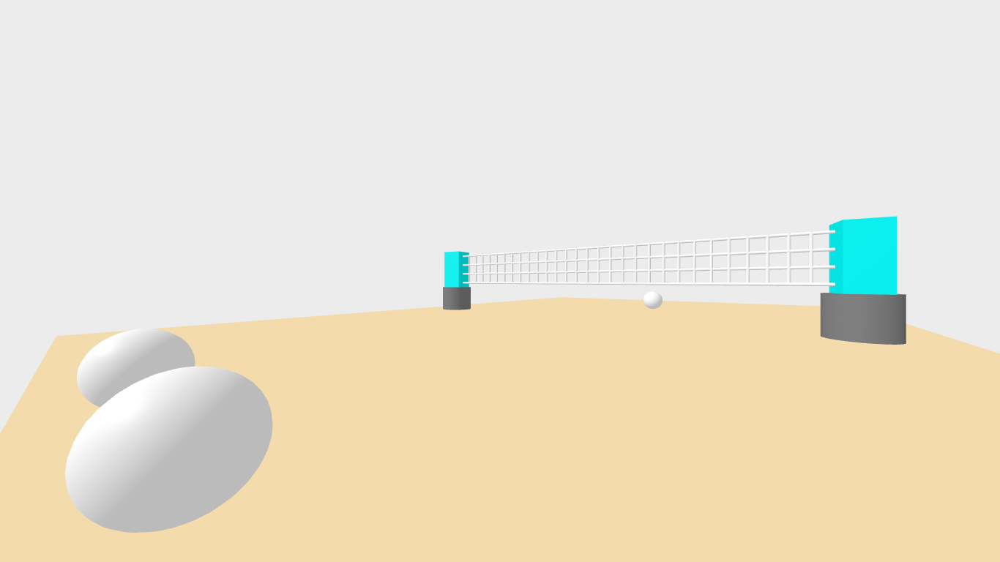

# Entry 4
#### 3/2/25


## Content

The Tool I am deciding to use is <b>aframe</b> because of the way you can design objects for your choice and make them seem somewhat real just from shapes and some html/css code. While I was changing some things around i decided to try to recreate a volleyball net in the scene since my topic is related to volleyball and making something that the audience would know, what my future invention is for makes things easier to explain its purpose. In the actual scene what I did was add some shapes or more specifically cylinders and squares and what happened was the positions, radius, color, height and width was made different so that they would create a realistic scene for my topic. Also I was able to include a floor and some balls to describe the scene better. Below is an image of how that scene looked.

This is a preview of what the code looks like but in a small amount.
```
<a-box position="-8 0.5 -3" rotation="0 10 0" height="5.5" color="#00FFFF"></a-box>
      <a-box position="8 0.5 -3" rotation="0 10 0" height="5.5" color="#00FFFF"></a-box>
      <a-sphere position="0 0.5 10" radius="0.5" color="#FFFFFF"></a-sphere>
      <a-sphere position="3 0.5 10" radius="0.5" color="#FFFFFF"></a-sphere>
      <a-sphere position="0.8 0.5 -10" radius="0.5" color="#FFFFFF"></a-sphere>
      <a-cylinder
        position="-8 0.5 -3"
        radius="0.8"
        height="1.5"
        color="#808080"
        rotate(90deg)
      ></a-cylinder>
      <a-cylinder
                position="-7 3 -3"
                  rotation="0 0 90"
                  radius="0.05"
      ></a-cylinder>
```
## Sources

<a href="https://aframe.io/">Aframe website</a>

<a href="https://glitch.com/edit/#!/quick-legendary-fin?path=index.html%3A23%3A20">Glitch website</a>

## EDP

The point at which I am at in the engineering design process is planning a promising solution because identifying a problem, researching the problem and imagining solutions are done. The idea of this is to make it so that as I making plans to create a solution i already have something that can provide clarity to the issue about my topic of volleyball. Listing my solution is important for the next step while creating an imersive experience for people to enjoy.

## Skills
#### Creativity
While I was tinkering around with the aframe scenes the idea of a volleyball net was something I had on my mind which would tie in my future invention to make it seem like a good idea although i would have to make it myself and by scratch. Basically I wanted the viewers to get a sense of familiarity with the sport so they could learn something new while observing an invention that could change the future of sports.
#### Patience 
This skill in particular was hard because creating the volleyball net itself was time consuming from all the moving of positions and height/width adjustments needed to perfect the scene or else it would look as if someone was not focused and not trying. In total i spent about an hour making changes all the way round which was annoying since i could have quit halfway and my grade would have been affected a lot more than a finished piece of code.
 
[Previous](entry03.md) | [Next](entry05.md)

[Home](../README.md)
