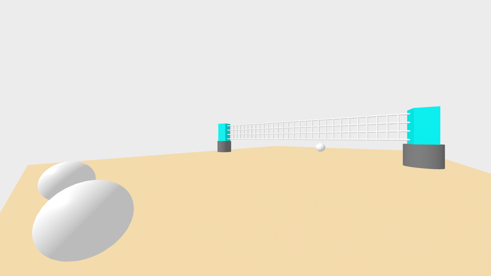

# Entry 5
##### 4/11/2025

## Content

During my time of experiencing Aframe and learning some code I found that you can make many things within the software, whether it is a place or an object, anything and you can get creative with it. During a few weeks of tinkering I discovered all sorts of effects and designs that could be implemented onto your projects but there are other multiple forms of code that are available for everyone as long you watch a video online or search up content on the website. As I was using Aframe my topic of volleyball i knew wouldn't be easy to replicate because you need nets, balls, a court and background. While starting out the scene I was able to make a net and plan some spheres onto the scene.



Not only that but I found out that you could actually get color and images onto these which got me tinkering a bit more and adding animation was what I imagined for the balls to make it appear more of a realistic scene that would actually give off professional intent to promote something. There were other things I wanted to try but sometimes they needed work and it took much more time to figure them out so I only added required coding tips.


Some of my ideas that can be added were interesting which involved lighting effects and moveable objects by clicking the object then viewing a reaction. An example would be like this code. This type of code can used to move objects in the scene so now there are more chances that the balls can move using raycasting.
```
<a-entity camera raycaster="objects: .clickable" cursor="fuse: true; maxDistance: 20; fuseTimeout: 1500"> </a-entity>
```

## Sources
Some of the sources that I used for reference were 
<a href="https://www.youtube.com/@uwrealitylab">Video</a>
## Skills


[Previous](entry04.md) | [Next](entry06.md)

[Home](../README.md)
