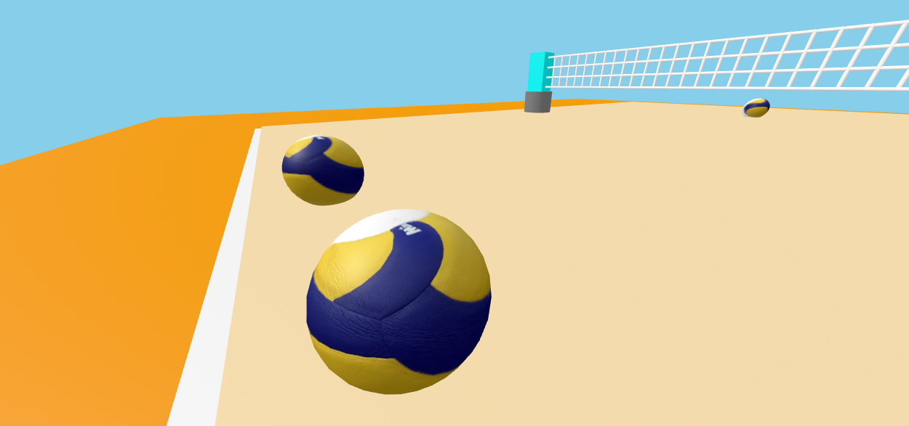
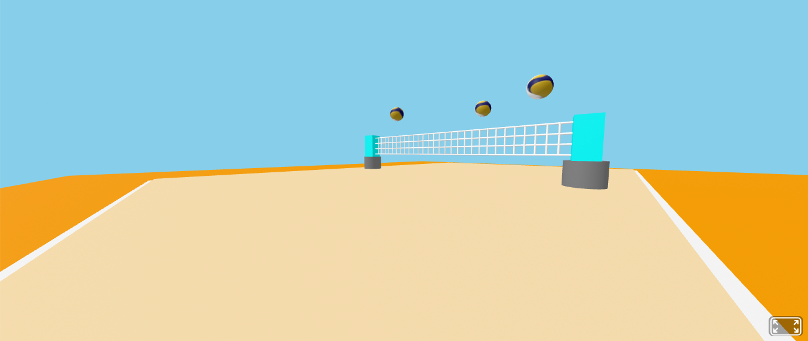

# Tool Learning Log

## Tool: **aframe**

---

### 3/2/25:
* Position, height, width, radius should be changed in objects placed in the scene.
* align the numbers carefully to match their respective places.
* volleyball net succesfully created.
* Work on fixing the ground and way the balls look as well as the outside.
* Start designing my invention to see what it looks like.

### 3/17/25:
* This type of code can used to move objects in the scene so now there are more chances that the balls can move using raycasting.`<a-entity camera raycaster="objects: .clickable" cursor="fuse: true; maxDistance: 20; fuseTimeout: 1500">
</a-entity>`

* More ideas of moveable objects in scenes could work as some people could visualize balls moving when there is a set being played.`<a-box position="0 1 -5" animation="property: rotation; to: 0 360 0; dur: 2000; loop: true"></a-box>
`

* Try to use these ideas once I use Aframe again.

### 3/23/25

* the object once clicked upon can change color if code is set to do so.
```
<!DOCTYPE html>
<html lang="en">
  <head>
    <meta charset="UTF-8" />
    <meta name="viewport" content="width=device-width, initial-scale=1.0" />
    <title>A-Frame Interactivity Example</title>
    <script src="https://aframe.io/releases/1.2.0/aframe.min.js"></script>
  </head>
  <body>
    <a-scene>
      <a-box position="0 1 -3" color="#4CC3D9"
             event-set__click="_event: click; color: #EF2D56">
      </a-box>
      <a-camera></a-camera>
    </a-scene>
  </body>
</html>
```
* animating the objects could also help better describe a scene when played in action.
* skybox or image can be added so that the background isn't plain


### 3/24/25

* Basic sky pattern could look like this
```
<a-sky src="path/to/your/skybox-image.jpg"></a-sky>
```

* finally put a picture on the objects


* Now animated objects in the end result

  

### 3/31/25

*Lighting effects can make peoplehave different opinions so we need to change it a bit.
```
  <a-light type="ambient" intensity="0.5"></a-light>
<a-light type="directional" intensity="0.8" position="1 3 1"></a-light>
```
* support for other devices can be useful if people decide to view my project from other devices.

  ```
  <a-entity
  geometry="primitive: box; width: 3; height: 3; depth: 3"
  position="0 2 -5"
  scale="1 1 1"
  mobile-scale="1.5 1.5 1.5"
  desktop-scale="1 1 1"
  ></a-entity>
  ```
* in case people want to look around but can't figure out the angle of camera we can use teleports.
  ```
  <a-scene>
  <a-entity camera look-controls="pointerLockEnabled: true" position="0 1.6 0"></a-entity>
  <a-entity id="teleport" teleport-controls="button: trigger;"></a-entity>
  </a-scene>
  ```

<!--
* Links you used today (websites, videos, etc)
* Things you tried, progress you made, etc
* Challenges, a-ha moments, etc
* Questions you still have
* What you're going to try next
-->
